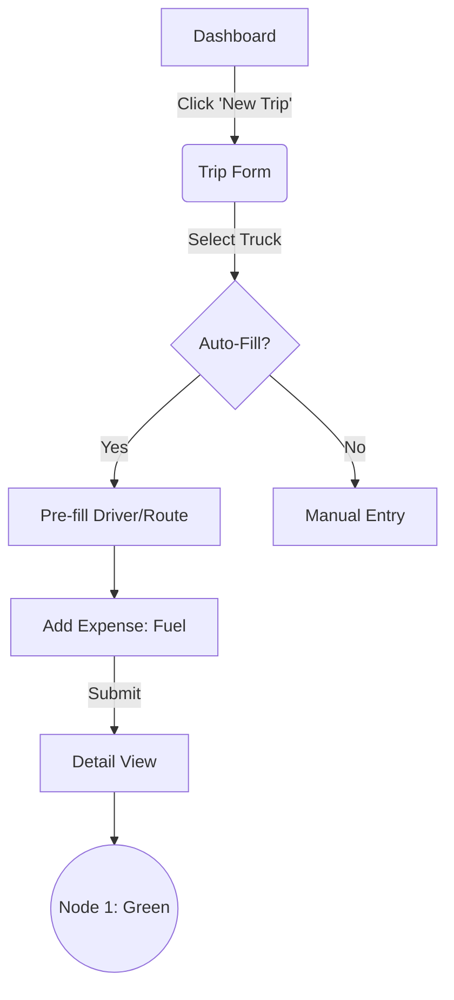
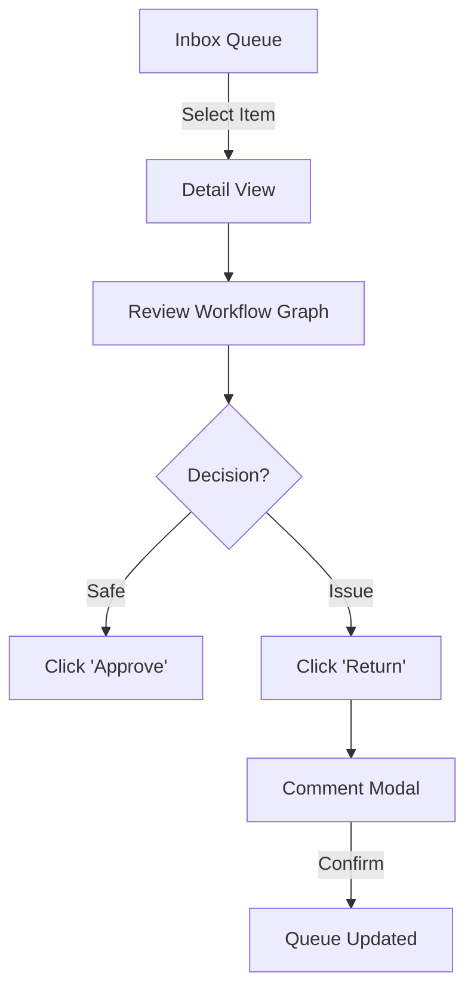

# UX Design Specification: edupo-tms

**Author:** Clinton
**Date:** 2026-01-24

---

## Executive Summary

### Project Vision
Edupo TMS is a strictly governed logistics platform that prioritizes financial control and assets visibility. It relies on a "Universal Expense Gate" where every cost is manually requested and manager-approved before payment. **Crucially, the system operates without GPS**, relying entirely on trusting-but-verifying manual data entry from the Operations team.

### Target Users
*   **Ops Officer (The Source):** Needs fast, friction-free data entry for Trips & Expenses. *Metric: Adoption Rate.*
*   **Manager (The Gate):** Needs a high-velocity "Decision Dashboard" to clear approval queues quickly. *Metric: Gate Velocity.*
*   **Finance (The Vault):** Needs a "Clean List" of approved items to pay and print vouchers. *Metric: Voucher Accuracy.*

### Key Design Challenges
1.  **Data Entry vs. Reality (No GPS):** Since the system cannot "see" the trucks, it relies on the Ops Officer to tell the truth.
    *   *Challenge:* If entry is tedious, they will skip it.
    *   *Solution:* **Smart Defaults**. Pre-fill standard values (Routes, Fuel costs, Arrival times) to reduce friction, but flag "Unchanged Defaults" for backend audit.
2.  **The "Gate" Friction:** Managers must approve *every* expense.
    *   *Challenge:* Decision fatigue.
    *   *Solution:* **Visual Triage**. Clearly separate "Urgent Truck Expenses" from "Routine Office Bills".
3.  **Module Navigation:**
    *   *Challenge:* 3 Distinct Modules (Ops, Fleet, Finance) need to feel connected but not cluttered.

### Design Opportunities
*   **"Transparency Tracker":** A visualized status status bar for every expense (Submitted -> Manager Waiting -> Finance Paid) to manage Ops anxiety without phone calls.
*   **"Smart Entry Forms":** Forms that learn or pre-fill data based on the selected Truck/Route to maximize speed.

## Core User Experience

### Defining Experience
The core experience is defined by **Velocity and Trust**.
*   **Ops Velocity:** Rapid manual entry via "Smart Defaults" and "Clone Trip" features.
*   **Manager Trust:** Information density. Managers need to see the context (Trip Profitability, Driver History) *on the same screen* as the approval button to make safe decisions quickly.

### Platform Strategy
*   **Primary:** **Desktop Web App** (Laptop/PC).
    *   *Rationale:* Managers and Ops officers primarily work from desks/laptops where they can view detailed tables and dashboards.
    *   *UX Focus:* High information density, keyboard shortcuts, and table views.
*   **Secondary:** Mobile Web (Responsive).
    *   *Use Case:* Emergency approvals while away from desk.

### Effortless Interactions
*   **"Repeat Trip" Button:** Clones the previous trip's details (Driver, Truck, Route) for rapid dispatch.
*   **"Contextual Approval":** When reviewing an expense, show the "Trip Profitability" snapshot in a side panel so the Manager never loses context.

### Critical Success Moments
*   **The "Paid" Notification:** When an Ops officer gets the alert that "Fund Released", enabling the truck to move. This closes the loop.
*   **"Inbox Zero":** The moment the Manager clears their "Pending Requests" queue.

## Desired Emotional Response

### Primary Emotional Goals
*   **Ops (Reassurance):** "My request is safe. If there's an issue, I know *exactly* what to fix."
*   **Manager (Control):** "I have the flexibility to Approve, Reject, or Delegate (Transfer) without bottlenecks."
*   **Finance (Clarity):** "Everything in my queue is 100% ready for payment."

### Emotional Journey Mapping & Communication
1.  **Submission:** Frictionless. Defaults pre-filled.
2.  **Review (Communicate):** The Manager reviews. If something is off, they don't just "Delete" it. They use **"Return with Comment"** (e.g., "Wrong amount, please fix").
    *   *Emotion:* Constructive Feedback vs. Rejection.
3.  **Transfer (Delegate):** If the Manager is busy or lacks authority, they **"Transfer"** to another Manager.
    *   *Emotion:* Relief (Unblocking).
4.  **Approval/Payment:** The final green light.

### Design Implications
*   **Conversation Thread:** Every request has a "Comments" tab (Chat-style) to track the back-and-forth context.
*   **Action Clarity (Color Coded):**
    *   **Approve:** Green (Move Forward).
    *   **Reject:** Red (Stop Dead).
    *   **Return:** Orange (Loop Back to User for Edit).
    *   **Transfer:** Blue/Gray (Move Sideways to another Reviewer).
*   **Active States:** Use distinct status badges (e.g., "Returned to User", "Pending: Manager B").

### Micro-Emotions
*   **"I was heard":** When a user gets a "Returned" status with a comment, they feel guided rather than punished.

## UX Pattern Analysis & Inspiration

### Primary Design Reference: "WakaWaka" (User Provided)
The specific visual language and workflow should mimic the provided screenshots ("WakaWaka system"), which represent a proven enterprise standard for this domain.

### Key Referenced Patterns
1.  **Workflow Visualization (The Node Graph):**
    *   **Pattern:** A flowchart diagram at the top of the detail view showing the exact path: `Started (User) -> Manager (Current) -> Finance (Pending)`.
    *   **Why:** Provides absolute transparency on "Where is my request?".
    *   **User Upload 1:** Shows green nodes for completed steps and distinct icons for roles.

2.  **Dense Data Tables (The Dashboard):**
    *   **Pattern:** High-density tables with status "pills" (Green/Red) and clear columns for "Process Initiator", "Type", "Receipt Time".
    *   **Why:** Allows managers to scan 20+ items at once without scrolling.
    *   **User Upload 2:** Shows the "To-do Tasks" queue.

3.  **Explicit Action Bar:**
    *   **Pattern:** Fixed button bar at the bottom/top with explicit verbs: `[Process]`, `[Return]`, `[Reject]`, `[Tracking]`.
    *   **Interaction:** Clicking "Reject" or "Return" opens a comment modal ("Approval Opinion").
    *   **User Upload 3:** Shows the Form Details with the specific button layout.

### Anti-Patterns to Avoid
*   **Hidden Actions:** Do not hide critical actions like "Return" inside a "..." menu. They must be visible buttons.
*   **Oversimplified UI:** Do not use "Mobile-style" cards for the desktop dashboard. Use proper grids/tables.

## Design System Foundation

### 1.1 Design System Choice
**Ant Design (AntD)** (React framework)

### Rationale for Selection
*   **Visual Match:** The "WakaWaka" screenshots use a classic enterprise aesthetic (dense tables, distinct borders, contrasting buttons) that AntD provides by default.
*   **Component Parity:**
    *   `ProTable` matches the "To-do Tasks" screenshot (Density control, Columns, Filters).
    *   `Steps` matches the "Tracking" node graph.
    *   `Descriptions` matches the "Form Details" view structure.
*   **Velocity:** Accelerates development of complex "Manager Queues" without custom CSS.

### Implementation Approach
*   **Framework:** React + Ant Design.
*   **Icons:** Ant Design Icons.
*   **Theme:** "Compact Mode" enabled to support high-density data tables.

### Customization Strategy
*   **Colors:** Override Ant Blue with specific Edupo brand colors (if defined), otherwise keep standard enterprise blue.
*   **Status Colors:** Enforce strict semantic colors (Green=Success, Red=Reject, Orange=Return).

## 2. Core User Experience (Detailed Mechanics)

### 2.1 Defining Experience
**The Visual Workflow Tracker:** The "WakaWaka-style" Node Graph is the source of truth. Every request detail page defines its state not by a text label ("Pending typically"), but by a visual map of the process steps.

### 2.2 User Mental Model
*   **Current Model:** "I sent the paper form to John's desk."
*   **New Model:** "I see the Digital Token sitting in John's box on the map."

### 2.3 Success Criteria
*   **Zero Ambiguity:** A user never has to ask "Who has my request?". The Map answers it.
*   **One-Click Audit:** Clicking any Node in the map shows the *Timestamp* and *Actor* (e.g., "John approved at 10:42 AM").

### 2.4 Novel UX Patterns
*   **"The Action Bar":** A persistent footer bar with distinct "Process" actions (Approve, Return, Transfer) that triggers a comment modal. This combines "Action" and "Feedback" into one seamless flow.

### 2.5 Experience Mechanics
*   **The "Process" Action:**
    *   *Trigger:* Manager clicks the blue "Process" button (from screenshot).
    *   *Interaction:* A Modal appears. Use "Quick Comments" (e.g., "Approved", "Need Receipt") to speed up typing.
    *   *Outcome:* The row vanishes from the "To-Do" list instantly.
*   **The "Tracking" View:**
    *   *Trigger:* Clicking the "Tracking" button or the Node Graph.
    *   *Interaction:* Displays the full audit log table below the graph (as seen in Screenshot 1).

## Visual Design Foundation

### Color System
*   **Primary Button:** `#1890ff` (Ant Design Blue - Standard Enterprise).
*   **Status Indicators:**
    *   🟢 `Completed/Success`: `#52c41a`
    *   🔴 `Rejected/Error`: `#ff4d4f`
    *   🟠 `Returned/Warning`: `#faad14`
*   **Data Density:** White backgrounds (`#ffffff`) with Gray borders (`#d9d9d9`) for maximum contrast.

### Typography System
*   **Font Family:** **Inter** (Preferred) or System Default Sans-Serif.
*   **Base Size:** `14px` (Standard), `12px` (Table Data/Secondary).
*   **Headings:** `16px` Bold (Section Headers) - conservative sizing to save screen real estate.

### Spacing & Layout Foundation
*   **Grid:** 24-column grid (Ant Design standard).
*   **Padding:** **Compact**. 8px/12px standard padding. Avoid "Airy" 24px+ padding used in consumer apps.
*   **Borders:** All sections (Trip Details, Accounting Info) must be enclosed in bordered cards to separate data groups visually.

## Design Direction Decision

### Design Directions Explored
We explored an "Enterprise Density" direction based on your "WakaWaka" reference, focusing on a split-view Manager Dashboard and a Node-Graph based Detail View.

### Chosen Direction
**"Ant Design Enterprise"**

### Design Rationale
This direction faithfully replicates the "WakaWaka" aesthetic you provided while leveraging modern Ant Design components (`Steps`, `ProTable`) for robust implementation. It prioritizes information density and clear status visualization over whitespace.

### Implementation Approach
*   **Layout:** Ant Design Pro Layout.
*   **Mockups:** See `ux-design-directions.html` for the interactive visual reference of the Queue and Detail views.

## User Journey Flows

### Journey 1: Ops Dispatch (The "Smart" Form)

### Journey 2: Manager Triage (The "Gate")

### Flow Optimization Principles
*   **The "One-Click Audit":** In Flow 2, the Manager doesn't need to leave the page to check validity. The `Detail View` contains the "Attachment Preview" (Odometer Photo) side-by-side with the form data.

## Component Strategy

### Design System Components (Ant Design)
*   **ProTable:** The backbone of the dashboard.
*   **Steps:** The visualization of the workflow.
*   **Statistic:** For the "Profit Impact" display.

### Custom Components (The "Gluing")
*   **StickyActionBar:** A container component that anchors the primary actions to the bottom of the viewport.
*   **StatusPillFactory:** A wrapper around `Tag` that enforces our strict Green/Red/Orange/Blue semantic coloring logic.

### Implementation Strategy
*   **Composability:** We will wrap AntD components rather than forking them. (e.g., `<EdupoTable>` wraps `<ProTable>` with our default density/pagination settings).

## UX Consistency Patterns

### Impact of "WakaWaka" Reference
These patterns are non-negotiable to match the reference system.

### The "Forced Comment" Pattern
*   **When to Use:** Any Destructive or Backwards workflow action (Reject, Return).
*   **Behavior:**
    1.  User clicks "Reject" (Red Button).
    2.  Modal opens: "Reason for Rejection *".
    3.  "Confirm" button is disabled until text is entered.
    4.  On Confirm -> Item removed from list immediately.

### The "Fixed Action Bar" Pattern
*   **When to Use:** Detail Views (Trip Detail, Expense Detail).
*   **Design:** A sticky footer (z-index 100) on Desktop.
*   **Content:**
    *   Left: Info Summary (Total Amount / Profit Impact).
    *   Right: Primary Actions (Approve, Reject).

### The "Optimistic List" Pattern
*   **When to Use:** Manager Queue.
*   **Behavior:** When an item is processed, remove it form the DOM *instantly* (optimistic update), then sync with server. Never show a full-page loading spinner for a single action.

## Responsive Design & Accessibility

### Responsive Strategy: Desktop-First
*   **Desktop (Primary):**
    *   **High-Density Tables:** `ProTable` with **User-Adjustable Columns** (Resize/Show/Hide) to allow managers to customize their view.
    *   **Layout:** Side-by-side Detail View (Form + Attachments).
*   **Mobile (Secondary - "Triage Mode"):**
    *   *Grid:* Collapses to Single Column.
    *   *Tables:* Convert to "Card List" (displaying only ID, Amount, Status).
    *   *Detail View:* Attachments move to a "View Receipts" tab instead of side-by-side.

### Accessibility Standards
*   **Status Indicators:** ALL colored status pills must include an Icon (Check/X/Clock) to support color-blind users.
*   **Keyboard Navigation:** "J/K" shortcuts to move up/down the manager queue (Gmail style) to support high-velocity approval without a mouse.

---

## Revision 1: Real-time Status Dashboard (Design Update)

**Date:** 2026-01-27
**Trigger:** User request with visual reference (`uploaded_media_1769498748263.png`).

### Visual Reference

### Design Specifications

#### 1. Layout Structure
*   **Sidebar Navigation (Left):**
    *   Dark theme/Navy Blue background.
    *   Items: Dashboard (Active), Inventory, Operations, Management, Office Expenses.
    *   User Profile & Settings at the bottom.
*   **Main Content Area (Right):**
    *   Light/Gray background (`#f5f7fa`).
    *   Clean white cards with soft shadows for widgets.

#### 2. Key Widgets (Top Row)
*   **Metric Cards:** 5 distinct summary cards with icons and trend data.
    *   **Total Trucks:** (e.g., "5", +2 from last month).
    *   **Completed Trips:** (e.g., "2", +15 this month).
    *   **Trucks In Transit:** (e.g., "1", 3 near destination) - Highlighted status.
    *   **Active Alerts:** (e.g., "4", 2 critical) - Critical for Manager intervention.
    *   **Avg. Profit/Day:** (e.g., "$751.19") - The "North Star" metric.

#### 3. Charts & Analytics (Middle Row)
*   **Profit Trend (Line Chart):**
    *   Title: "Profit Trend (Last 6 months)".
    *   Visual: Smooth curve line chart showing financial performance over time.
    *   Context: Essential for "General Manager" oversight.
*   **Vehicle Utilization (Bar/Stack Chart):**
    *   Title: "Vehicle Utilization (Current fleet status)".
    *   Horizontal bars showing count by status: `Idle`, `In Transit`, `At Border`, `Maintenance`.
    *   Color coded (Orange/Navy/Teal/Blue).

#### 4. Recent Trips (Bottom Row)
*   **Table View:**
    *   Title: "Recent Trips (An overview of the last 5 trips)".
    *   Columns:
        *   **Driver:** Avatar + Name (e.g., Jane Smith).
        *   **Destination:** Text (e.g., Cape Town).
        *   **Status:** Pill Badge (e.g., `Departed` [Blue], `In Transit` [Orange], `At Border` [Red], `Completed` [Green]).
        *   **Profit:** Currency value (Green text for positive).

### Interaction Updates
*   **Real-time Updates:** As specified in Story 2.6, the "Active Alerts" and "Trucks In Transit" widgets must update instantly via WebSocket.
*   **Click Actions:**
    *   Clicking "Active Alerts" card filters the "Recent Trips" table or navigates to "Operations > Alerts".
    *   Clicking a Trip Row navigates to the *Trip Detail View* (the Node Graph view defined in original spec).

---

## Revision 2: Country and City Settings (Master Data)

**Date:** 2026-01-30
**Trigger:** User request to improve structure and avoid data repetition (`cities.txt` analysis).

### Problem Statement
The current flat structure (or mixed list) for Locations results in:
1.  **Data Repetition:** The Country name is repeated (conceptually or physically) for every city.
2.  **Cognitive Load:** Hard to scan specific cities within a country when the list is mixed or massive.
3.  **Maintenance Risk:** "DRC" vs "D.R.C" vs "Congo" inconsistencies if typed manually.

### Design Solution: Hierarchical Master-Detail
**Pattern:** **Ant Design Tree Table (Nested Data)**

### Visual Specification
1.  **The Hierarchy:**
    *   **Level 1 (Parent):** Country (e.g., "Zambia", "Tanzania").
    *   **Level 2 (Child):** City (e.g., "Lusaka", "Dar es Salaam").

2.  **Table Structure:**
    *   **Column 1: Name** (Tree Node).
        *   Country: Bold Text, Folder Icon adjacent.
        *   City: Indented, Dot/Pin Icon.
    *   **Column 2: Code/Abbreviation** (e.g., "ZMB", "LUN").
    *   **Column 3: Sorting Order** (Editable Input).
    *   **Column 4: Actions** (Contextual).
        *   Country Row: `[+ Add City]` `[Edit]` `[Delete]`.
        *   City Row: `[Edit]` `[Delete]`.

### Interaction Flow
1.  **Adding a Country:**
    *   Click global `[+ Add Country]` button.
    *   Modal: "Country Name", "Code".
2.  **Adding a City:**
    *   Find Country in list (e.g., "Zambia").
    *   Click `[+]` button on that row.
    *   Modal: "City Name", "Sorting". (Country is pre-filled and locked).
3.  **Importing (Bulk):**
    *   System accepts the indented text format (as provided in `cities.txt`) to auto-generate the hierarchy.

### Data Model Implication (UX View)
To support "Don't Repeat Yourself":
### 4. Current Location Tracking (API Integration)
**Goal:** Allow Ops/Drivers to report "Current Location" accurately without typing errors ("Ilala" vs "Ilala District").

**Interaction:**
*   **Widget:** `LocationAutocomplete` (Powered by **Radar.com**).
*   **Behavior:**
    1.  User types "Ilal..."
    2.  Dropdown shows: `Ilala, Dar es Salaam, Tanzania`.
    3.  User selects it.
    4.  System explicitly captures: `City: Ilala`, `Region: Dar es Salaam`, `Country: Tanzania`.
---

## Revision 3: Comprehensive Waybill Tracking Report

**Date:** 2026-01-30
**Trigger:** User request for "All important data visible" and "Excel Ready".

### Goal
Provide a "Control Tower" view for Operations to track the lifecycle of every cargo movement from Order to Delivery, with one-click export for reporting.

### Visual Specification
*   **Component:** `ProTable` (Ant Design) with `size="small"` (High Density).
*   **Toolbar:**
    *   **Search:** Global search (Client, Waybill #, Trip #).
    *   **Filters:** Status (Open, In Transit, Delivered), Date Range, Client.
    *   **Primary Action:** `[ 📥 Export to Excel ]` (Prominent Button).

### Data Grid Columns (The "All Important Data" View)
1.  **Status:** Badge (e.g., 🟢 Delivered, 🔵 In Transit, 🟡 Pending).
2.  **Waybill #:** Link to Waybill Detail.
3.  **Trip #:** Link to Trip Detail (Null if not assigned).
4.  **Client:** Name of the customer.
5.  **Cargo:** Type + Description (e.g., "Copper Cathodes").
6.  **Route:** Origin → Destination (Arrow formatted).
7.  **Assets:** Truck Plate + Trailer + Driver Name (Stacked).
8.  **Dates:**
    *   *ETA:* Expected Date.
    *   *Actual:* Delivery Date (or "---").
9.  **Current Location:** Live/Last reported location.

### Interaction Design
*   **Row Click:** Opens drawer/modal with quick summary.
*   **Export Behavior:**
    *   Frontend converts the *current filtered view* to `.xlsx`.
    *   **Template:** The Excel file must have a professional header ("Edupo TMS - Waybill Report - Generated on [Date]").

### Technical Note
---

## Revision 4: High Density & Typography Update

**Date:** 2026-01-30
**Trigger:** User request to match standard high-density interfaces (e.g., Radar.com) on 2560x1600 resolution.

### Visual Specification
*   **Density Algorithm:** Enable Ant Design `compactAlgorithm`.
    *   *Effect:* Reduces padding in Tables, Cards, and Inputs.
*   **Typography:**
    *   **Base Font Size:** Reduce from `14px` (Default) to **12px**.
    *   *Why:* Matches the high information density of logistics "Control Tower" displays.

### Implementation Checklist
- [ ] Create `frontend/src/theme/themeConfig.ts` with centralized settings.
- [ ] Apply `ConfigProvider` globally in `layout.tsx`.

## Revision 5: Control Tower Refinement

**Date:** 2026-01-30
**Trigger:** User request for tabular "Control Tower" adjustments.

### Requirements
1.  **Single Row Entry:** Each row must represent one entry (no multiline rows).
2.  **Adjustable Columns:** Users must be able to resize column widths.
3.  **Horizontal Scroll:** Table must scroll horizontally if columns exceed viewport width (sticky columns for ID/Actions recommended).
4.  **Advanced Filtering:** Quick filters for status and search must be efficient.

### Component Configuration
*   **Component:** `ProTable` (Ant Design).
*   **Props:**
    *   `scroll={{ x: 'max-content' }}` to enable horizontal scrolling.
    *   `resizable={true}` (via `ProComponents` or custom wrapper) for column sizing.
    *   `rowSelection={false}` unless bulk actions are needed.
    *   `search={{ filterType: 'light' }}` for filtering.

## Revision 6: Global Admin & Settings Module

**Date:** 2026-01-30
**Trigger:** User request for full system configurability ("No developer needed").

### Goal
Empower Administrators to manage all system variables, master data, and users directly through the UI.

### Inforation Architecture: The "Settings" Module
A dedicated **Settings** section in the main navigation (or bottom sidebar), distinct from daily operations.

#### 1. Operations Settings (Master Data)
*   **Location Management:**
    *   Countries (Name, Code, Sort Order).
    *   Cities/Locations (Name, Country Link, Type).
*   **Logistics Variables:**
    *   **Cargo Types:** Manage dropdown options (e.g., "Copper", "Sulphur").
    *   **Vehicle Statuses:** Define lifecycle states (e.g., "Parked", "In Transit").
    *   **Trailer Types:** (Flatbed, Tanker, etc.).
    *   **Expense Categories:** Manage allowable expense types.
*   **Waybill Settings:**
    *   Sequence Numbering configuration (if applicable).
    *   Terms & Conditions text.

#### 2. User & Security Settings
*   **User Management:**
    *   **List View:** All system users (Grid with Status/Role).
    *   **Actions:** `[Add User]`, `[Edit]`, `[Reset Password]`, `[Deactivate]`.
*   **Role Management (RBAC):**
    *   Define permissions for Roles (Admin, Manager, Ops, Finance).
    *   *Note:* Critical for defining who can see "Profit" data.

### Interaction Patterns
*   **"Inline Edit" vs "Modal":** Use **Modals** for adding/editing simple master data (e.g., adding a Cargo Type) to keep context.
*   **Audit Log:** All setting changes must be logged (Who changed "Fuel Price" variable and when?).

### Visual Design
*   **Layout:** Vertical Tabs for navigation within Settings (e.g., "General", "Users", "Master Data").
*   **Component:** `ProList` or `EditableProTable` for managing lists of values (e.g., Cargo Types).

